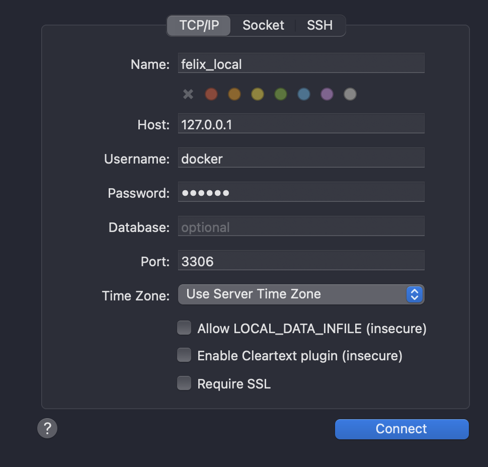

# felix-api

## Dev

### 1. Create `.env` file

```.sh
cp .env-sample.txt .env
```

### 2. Set up MySQL

```.sh
docker-compose up -d
```

### 3. Install modules

```.sh
pnpm install
```

### 4. Start coding

```.sh

# Insert seeds that existing data and plan.
pnpm prisma:prepare

pnpm dev
```

## Documents

- [firebase admin](https://firebase.google.com/docs/admin/migrate-node-v10)
- [firebase auth](https://firebase.google.com/docs/reference/rest/auth#section-api-usage)

## Modules

- [express](https://expressjs.com/en/5x/api.html)
- [got](https://github.com/sindresorhus/got/tree/main)
- [prisma](https://www.prisma.io/)
- [consola](https://github.com/unjs/consola)
- [vitest](https://vitest.dev/)
- [zod](https://zod.dev/)

## Recommended Softwares

- [Docker Desktop](https://docs.docker.com/desktop/install/mac-install/)
- [Sequel Ace](https://apps.apple.com/us/app/sequel-ace/id1518036000?mt=12)

---

## Note

### Proper Database status in Docker Desktop

After `docker-compose up -d`:

#### Containers


#### Images


#### Volumes


### Login local MySQL with Sequel Ace



- Name: Whatever you want.
- Host: `127.0.01`
- Username: `docker`
- Password: `docker`
- Port: `3306`


